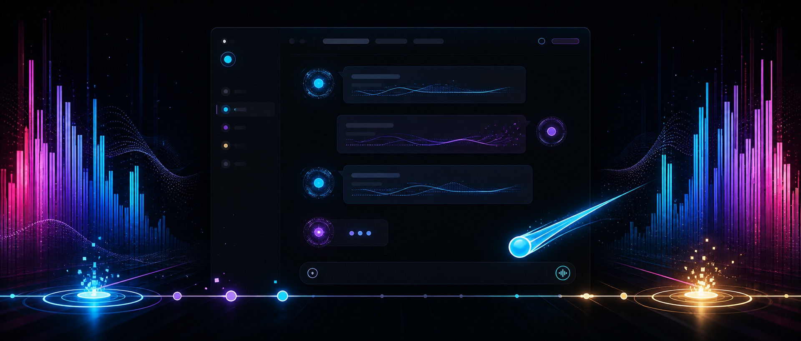

# dsh-bgm · Music-reactive DSH Web

[中文](README.md) | English

<p align="center">
  
</p>

<p align="center">
  <a href="https://github.com/skymecode/dsh-bgm/releases/latest"></a>
  &nbsp;
  <a href="https://github.com/skymecode/dsh-bgm/actions/workflows/ci.yml"></a>
  &nbsp;
  <a href="LICENSE"></a>
</p>

dsh-bgm turns system audio into rhythm-game feedback for the official DSH Web UI. It captures the default output device independently of the music player, maps bass/onset to Deep Diving, maps mid/treble changes to the latest reasoning or tool row, and keeps final-answer text readable and still.

The wide-screen layout gains two optional 12-bar RGB spectrum banks in the empty gutters; the banks move as a continuous travelling wave that flows from the outer edges toward the conversation, with a beat crest merging inward on every downbeat. Stable activity text forms a continuous BPM-locked wave surface; predicted notes fly toward a judgement line and build Score, Accuracy and Combo. Score and PERFECT milestones trigger card-game rewards: a light pill card from 1,000–5,000 points, then a full card that tumbles in from the upper-left with a 3D flip, lands on the right and pops like the rank reveal. A completed answer can end with a transparent 3.2-second score roll, rank burst, note rain and staggered statistics reveal.

## Install into the official DSH Web profile

Supports DSH `0.1.0-rc.8`, `0.1.1-rc.1`, and the latest `0.1.1-rc.2`. The release tarball contains a universal macOS helper and a self-contained Windows x64 helper, so the install does not need a source build:

```sh
dsh plugin --profile web add https://github.com/skymecode/dsh-bgm/releases/latest/download/dsh-bgm.tgz
dsh web
```

Pinned release:

```sh
dsh plugin --profile web add https://github.com/skymecode/dsh-bgm/releases/download/v0.1.2/dsh-bgm.tgz
```

Remove it with:

```sh
dsh plugin --profile web remove dsh-bgm
```

Supported hosts:

- macOS 14.2 or later, Apple Silicon and Intel. The first run requests system-audio recording permission.
- Windows 10/11 x64. No separate .NET installation is required.
- Linux currently has no loopback helper and reports an unsupported state without restart loops.

## Privacy and performance

- Raw PCM stays in the local native helper's memory and is never recorded, persisted or uploaded.
- The browser receives only RMS, bass, mid, treble, onset and timestamps.
- Streaming React text is never rebuilt into per-glyph mirrors.
- The 24 atmosphere bars are persistent nodes updated only through GPU-composited transforms and opacity; the travelling wave adds no per-bar filters or layout reads.
- Reduced-motion preferences disable the primary animations.

## Development

```sh
git clone https://github.com/skymecode/dsh-bgm.git
cd dsh-bgm
pnpm install
pnpm run typecheck
pnpm run build
dsh plugin --profile web add link:.
```

CI builds Host and Client bundles, produces universal macOS and Windows x64 native helpers, inspects the packed artifact, and mounts it into clean official DSH `0.1.0-rc.8`, `0.1.1-rc.1`, and `0.1.1-rc.2` Web profiles. A `v*` tag assembles `dsh-bgm.tgz`, writes `SHA256SUMS.txt`, and publishes both through GitHub Releases.

## License

[MIT](LICENSE). See [THIRD_PARTY_NOTICES.md](THIRD_PARTY_NOTICES.md) for NAudio licensing.
